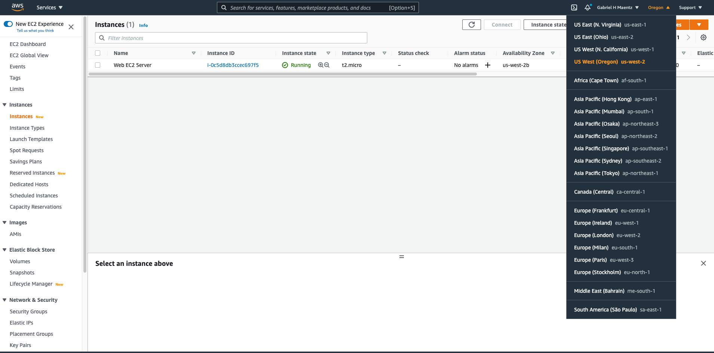

# Lab: Configure Terraform AWS Provider

Use the Amazon Web Services (AWS) provider to interact with the many resources supported by AWS. You must configure the provider with the proper credentials before you can use it.

- Task 1: Check Terraform AWS provider version
- Task 2: Configure Terraform AWS Provider

## Task 1: Check Terraform version

Run the following command to check the Terraform version:

```shell
terraform -version
```

You should see:

```text
Terraform v1.0.8
```

## Task 2: Configure Terraform AWS Provider

Edit the `provider` block within the `main.tf` to configure the Terraform AWS provider.

`terraform.tf`

```hcl
# Configure the AWS Provider
provider "aws" {
  region = "us-east-1"
}
```

This informs Terraform that it will deploy services into the `us-east-1` region within AWS.

# Task 2: Configure AWS Credentials for Terraform provider

The AWS Terraform provider offers a flexible means of providing credentials for authentication. The following methods are supported:

## Static credentials

Static credentials can be provided by adding an access_key and secret_key in-line in the AWS provider block:

```hcl
provider "aws" {
  region     = "us-east-1"
  access_key = "my-access-key"
  secret_key = "my-secret-key"
}
```

## Environment variables

You can provide your credentials via the `AWS_ACCESS_KEY_ID` and `AWS_SECRET_ACCESS_KEY`, environment variables, representing your AWS Access Key and AWS Secret Key, respectively.

```hcl
provider "aws" {
}
```

```bash
$ export AWS_ACCESS_KEY_ID="anaccesskey"
$ export AWS_SECRET_ACCESS_KEY="asecretkey"
$ export AWS_DEFAULT_REGION="us-east-1"
```

## Shared credentials/configuration file

You can use an AWS credentials or configuration file to specify your credentials. The default location is `$HOME/.aws/credentials` on Linux and macOS, or `"%USERPROFILE%\.aws\credentials"` on Windows. You can optionally specify a different location in the Terraform configuration by providing the shared_credentials_file argument or using the AWS_SHARED_CREDENTIALS_FILE environment variable. This method also supports a profile configuration and matching AWS_PROFILE environment variable.

```hcl
provider "aws" {
  region                  = "us-east-1"
  shared_credentials_file = "/Users/tf_user/.aws/creds"
  profile                 = "customprofile"
}
```

Let's recreate our infrastructure inside a different AWS region. Since we have defined everything in code, then it will be easy to modify the `region` attribute within our AWS provider block.

Before doing so, let's destroy the items if the already exist and recreate them inside a different AWS Region

```bash
terraform destroy
```

```bash
Plan: 0 to add, 0 to change, 21 to destroy.

Do you really want to destroy all resources?
  Terraform will destroy all your managed infrastructure, as shown above.
  There is no undo. Only 'yes' will be accepted to confirm.

  Enter a value: yes
```

```bash
Destroy complete! Resources: 21 destroyed.
```

Once the infrastructure has been from our configured region, (in the example's case `us-east-1`), we can modify the `region` argument in the `provider` block to specify a different region.

Update your `main.tf` to specify a different AWS region to redeploy your infrastructure.

```hcl
provider "aws" {
  region     = "us-west-2"
}
```

Save your file and issue a `terraform plan`

```bash
terraform plan
```

```bash
Plan: 21 to add, 0 to change, 0 to destroy.
```

```bash
terraform apply
```

```bash
Plan: 21 to add, 0 to change, 0 to destroy.

Do you want to perform these actions?
  Terraform will perform the actions described above.
  Only 'yes' will be accepted to approve.

  Enter a value: yes
```

```bash
Apply complete! Resources: 21 added, 0 changed, 0 destroyed.
```


