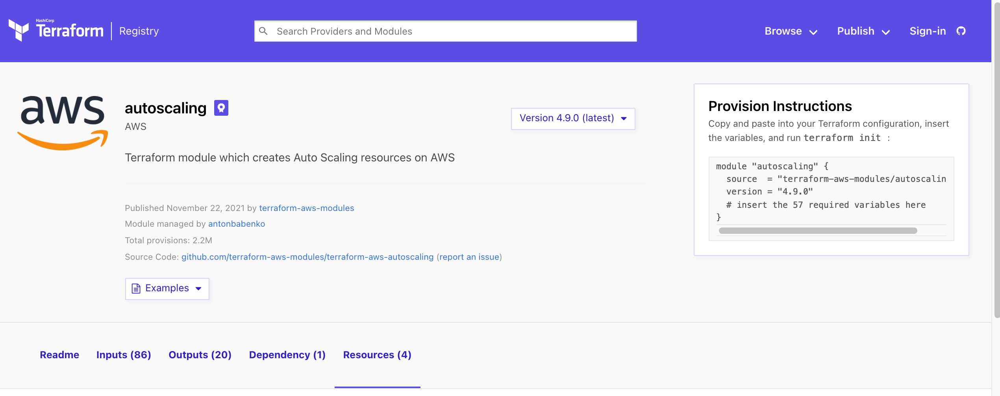
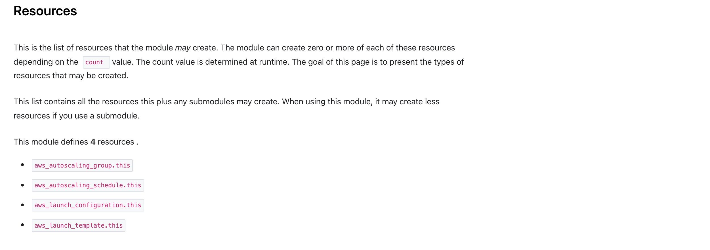
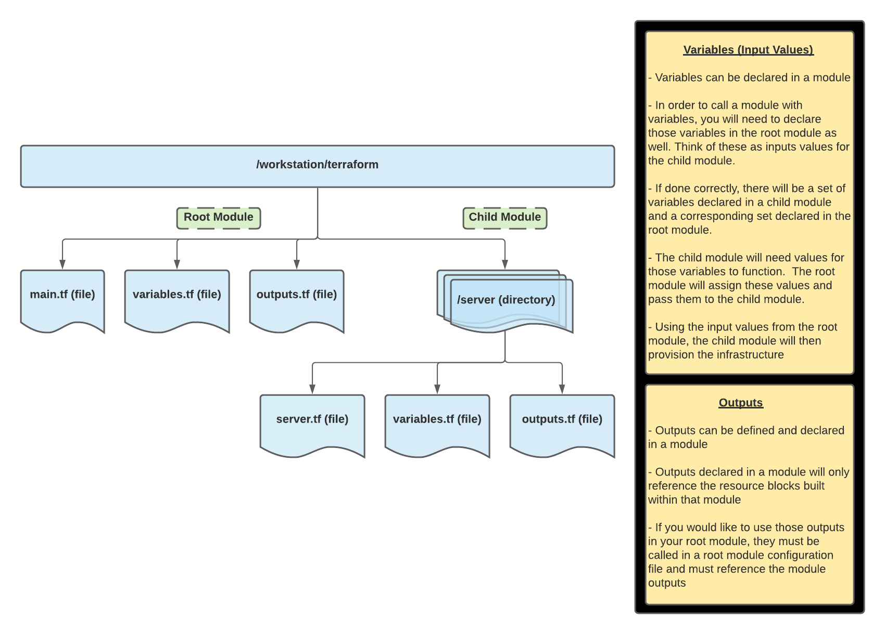

# Terraform Module Scope

Deciding what infrastructure to include is the one of the most challenging aspects about creating a new Terraform module.

Modules should be opinionated and designed to do one thing well. If a module's function or purpose is hard to explain, the module is probably too complex. When initially scoping your module, aim for small and simple to start.

- Task 1: Resources within Child Modules
- Task 2: Scoping Module Inputs and Outputs
- Task 3: Reference Child Module Outputs
- Task 4: Invalid Module References

## Task 1: Resources within Child Modules

In principle any combination of resources and other constructs can be factored out into a module, but over-using modules can make your overall Terraform configuration harder to understand and maintain, so we recommend moderation. A good module should raise the level of abstraction by describing a new concept in your architecture that is constructed from resource types offered by providers.

Let's take a closer look at the auto scaling group module that we are calling to further understand which resources are used to construct the module. Inside our `main.tf` we can see that the autoscaling module we are calling is being sourced from the [Terraform Public Module registry](https://registry.terraform.io/modules/terraform-aws-modules/autoscaling/aws/latest), and we are passing 10 inputs into the module.

`main.tf`

```hcl
module "autoscaling" {
  source  = "terraform-aws-modules/autoscaling/aws"
  version = "4.9.0"

  # Autoscaling group
  name = "myasg"

  vpc_zone_identifier = [aws_subnet.private_subnets["private_subnet_1"].id, aws_subnet.private_subnets["private_subnet_2"].id, aws_subnet.private_subnets["private_subnet_3"].id]
  min_size            = 0
  max_size            = 1
  desired_capacity    = 1

  # Launch template
  use_lt    = true
  create_lt = true

  image_id      = data.aws_ami.ubuntu.id
  instance_type = "t3.micro"

  tags_as_map = {
    Name = "Web EC2 Server 2"
  }

}
```



This module combines four different AWS resources, accepts up to 86 inputs and returns 20 possible outputs. It also has a dependency on the AWS provider.



```
aws_autoscaling_group
aws_autoscaling_schedule
aws_launch_configuration
aws_launch_template
```

Execute a `terraform init` and `terraform apply` to build out the infrastructure including the Auto Scaling group module. View the items that this module built by running a `terraform state list`

```hcl
terraform state list

module.autoscaling.data.aws_default_tags.current
module.autoscaling.aws_autoscaling_group.this[0]
module.autoscaling.aws_launch_template.this[0]
```

This module built out an autoscaling group and launch template as well as looked up default tags via a data block. You will notice that while this module could have built out more resources, these items were all that needed based on the configuration we passed into the module.

## Task 2: Scoping Module Inputs and Outputs

When looking at the scope of a module block, this diagram provides a helpful way to understand the relationshiop between root modules and child modules.



Modules are simply terraform configuration files that have optional/required inputs and will return a specifed number of outputs. The configuration within the module can be akin to a black box, as the module is abstracting away the configuration blocks which it contains. The module code for child modules is still typically availabe for us to review if we like, but not required to be able to get resources built out without having to worry about all of the details within the child module.

When creating a module, consider which resource arguments to expose to module end users as input variables. In our example, the autoscaling module provides up to 86 different inputs that can be used for configuring the ASG. Variables declared in child module map to arguments within root module block, where outputs declared in child module map to attributes that can used by the root module. You should also consider which values to add as outputs, since outputs are the only supported way for users to get information about resources configured by the module. In our example, the autoscaling module provides 20 available outputs that the module will return.

To view the outputs returned by our autosclaing module and their values you can issue the following:

```bash
terraform console

> module.autoscaling

{
  "autoscaling_group_arn" = "arn:aws:autoscaling:us-east-1:508140242758:autoScalingGroup:2a33891c-6c8b-4434-9386-bf1f1574523d:autoScalingGroupName/myasg-20211218123153166900000003"
  "autoscaling_group_availability_zones" = toset([
    "us-east-1b",
    "us-east-1c",
    "us-east-1d",
  ])
  "autoscaling_group_default_cooldown" = 300
  "autoscaling_group_desired_capacity" = 1
  "autoscaling_group_health_check_grace_period" = 300
  "autoscaling_group_health_check_type" = "EC2"
  "autoscaling_group_id" = "myasg-20211218123153166900000003"
  "autoscaling_group_load_balancers" = toset(null) /* of string */
  "autoscaling_group_max_size" = 1
  "autoscaling_group_min_size" = 0
  "autoscaling_group_name" = "myasg-20211218123153166900000003"
  "autoscaling_group_target_group_arns" = toset(null) /* of string */
  "autoscaling_group_vpc_zone_identifier" = toset([
    "subnet-01dcabb8c2474bd4f",
    "subnet-0d29fb83c81f6278b",
    "subnet-0e509d03fb7841876",
  ])
  "autoscaling_schedule_arns" = (known after apply)
  "launch_configuration_arn" = (known after apply)
  "launch_configuration_id" = (known after apply)
  "launch_configuration_name" = (known after apply)
  "launch_template_arn" = "arn:aws:ec2:us-east-1:508140242758:launch-template/lt-0bdc46cf90ccdad50"
  "launch_template_id" = "lt-0bdc46cf90ccdad50"
  "launch_template_latest_version" = 1
}
```

## Task 3: Reference Child Module Outputs

In order to reference items that are returned by modules (by the child module's `outputs.tf` file) you must use the interpolation syntax referring to the output name returned by the module. Eg: `module.autoscaling.autoscaling_group_max_size`

Refering to the `autoscaling_group_max_size` of the autoscaling module within the root module:

Let's add an output block inside the `main.tf` of root module to showcase the `autoscaling_group_max_size` returned by the autoscaling group child module.

```hcl
output "asg_group_size" {
  value = module.autoscaling.autoscaling_group_max_size
}
```

```bash
terraform apply

Outputs:
asg_group_size = 1
```

## Task 4: Invalid Module References

Module outputs are the only supported way for users to get information about resources configured within the child module. Individual resource arguments are not accessible outside the child module.

If we look at the `outputs.tf` of autoscaling group child module we can see the one of the items returned by this module is the `autoscaling_group_max_size`. Looking at the code this is returned based on the value of the `aws_autoscaling_group.this[0].max_size` resource. We don't need to be too occupied with how this value is set since the module is abstracting away these complexities for us.

```hcl
output "autoscaling_group_max_size" {
  description = "The maximum size of the autoscale group"
  value       = try(aws_autoscaling_group.this[0].max_size, "")
}
```

All we need to be concerned about is the `autoscaling_group_max_size` output that is returned. In fact, unless a child module provides us with an output that we can consume we will not be able to reference items within the child module. Individual resource arguments are not accessible outside the child module.

```
module "my-module" {
  # Source can be any URL or file path
  source = "../../my-module"

  argument_1 = "value"
  argument_2 = "value"
}

# Valid
output "example" {
  value = module.my-module.public_ip
}

# Invalid
output "example" {
  value = module.my-module.aws_instance.db.public_ip
}
```

To showcase this, create an output block within the root module `main.tf` that references a resource argument directly within the autoscaling child module.

`main.tf`

```hcl
output "asg_group_size" {
  value = module.autoscaling.aws_autoscaling_group.this[0].max_size
}
```

```bash
terraform validate

|Error: Unsupported attribute
|
|  on main.tf line 382, in output "asg_group_size":
| 382:   value = module.autoscaling.aws_autoscaling_group.this[0].max_size
|    |---------------
|    |module.autoscaling is a object, known only after apply
|
|This object does not have an attribute named "aws_autoscaling_group".
```

Now correct this to reference the valid output returned by the module:

```hcl
output "asg_group_size" {
  value = module.autoscaling.autoscaling_group_max_size
}
```

```bash
teraform validate

Success! The configuration is valid.
```

It is therefore a best practice when creating terraform modules to output as much information as possible, even if you do not currently have a use for it. This will make your module more useful for end users who will often use multiple modules, using outputs from one module as inputs for the next.

## Notes about building Terraform Modules

When building a module, consider three areas:

- **Encapsulation:** Group infrastructure that is always deployed together. Including more infrastructure in a module makes it easier for an end user to deploy that infrastructure but makes the module's purpose and requirements harder to understand
- **Privileges:** Restrict modules to privilege boundaries. If infrastructure in the module is the responsibility of more than one group, using that module could accidentally violate segregation of duties. Only group resources within privilege boundaries to increase infrastructure segregation and secure your infrastructure
- **Volatility:** Separate long-lived infrastructure from short-lived. For example, database infrastructure is relatively static while teams could deploy application servers multiple times a day. Managing database infrastructure in the same module as application servers exposes infrastructure that stores state to unnecessary churn and risk.

A simple way to get start with creating modules is to:

- Always aim to deliver a module that works for at least 80% of use cases.
- Never code for edge cases in modules. An edge case is rare. A module should be a reusable block of code.
- A module should have a narrow scope and should not do multiple things.
- The module should only expose the most commonly modified arguments as variables. Initially, the module should only support variables that you are most likely to need.
