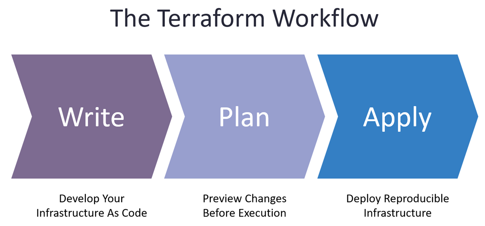

# Lab: Terraform Workflow

The core Terraform workflow has three steps:

1. Write - Author infrastructure as code.
2. Plan - Preview changes before applying.
3. Apply - Provision reproducible infrastructure.



The command line interface to Terraform is via the terraform command, which accepts a variety of subcommands such as terraform init or terraform plan. The Terraform command line tool is available for MacOS, FreeBSD, OpenBSD, Windows, Solaris and Linux.

- Task 1: Verify Terraform installation
- Task 2: Using the Terraform CLI
- Task 3: Initializing a Terraform Workspace
- Task 4: Genenerating a Terraform Plan
- Task 5: Applying a Terraform Plan
- Task 6: Terraform Destroy

## Task 1: Verify Terraform installation

Run the following command to check the Terraform version:

```shell
terraform -version
```

You should see:

```text
Terraform v0.12.6
```

## Task 2: Using the Terraform CLI

You can get the version of Terraform running on your machine with the following command:

```bash
terraform -version
```

If you need to recall a specific subcommand, you can get a list of available commands and arguments with the help argument.

```bash
terraform -help
```

## Write

The Terraform language is Terraform's primary user interface. In every edition of Terraform, a configuration written in the Terraform language is always at the heart of the workflow.

## Task 3: Terraform Init

Initializing your workspace is used to initialize a working directory containing Terraform configuration files.

Copy the code snippet below into the file called `main.tf` This snippet leverages the random provider, maintained by HashiCorp, to generate a random string.

`main.tf`

```hcl
resource "random_string" "random" {
  length = 16
}
```

Once saved, you can return to your shell and run the init command shown below. This tells Terraform to scan your code and download anything it needs,locally.

```bash
terraform init
```

Once your Terraform workspace has been initialized you are ready to begin planning and provisioning your resources.

> Note: You can validate that your workspace is initialized by looking for the presence of a `.terraform` directory. This is a hiddent directory, which Terraform uses to manage cached provider plugins and modules, record which workspace is currently active, and record the last known backend configuration in case it needs to migrate state. This directory is automatically managed by Terraform, and is created during initialization.

## Task 4: Genenerating a Terraform Plan

Terraform has a dry run mode where you can preview what Terraform will change without making any actual changes to your infrastructure. This dry run is performed by running a `terraform plan`.

In your terminal, you can run a plan as shown below to see the changes required for Terraform to reach your desired state you defined in your code. This is equivalent to running Terraform in a "dry" mode.

```bash
terraform plan
```

If you review the output, you will see 1 change will be made which is to generate a single random string.

> Note: Terraform also has the concept of planning out changes to a file. This is useful to ensure you only apply what has been planned previously. Try running a plan again but this time passing an -out flag as shown below.

```bash
terraform plan -out myplan
```

This will create a plan file that Terraform can use during an `apply`.

## Task 5: Applying a Terraform Plan

Run the command below to build the resources within your plan file.

```bash
terraform apply myplan
```

Once completed, you will see Terraform has successfully built your random string resource based on what was in your plan file.

Terraform can also run an `apply` without a plan file. To try it out, modify your `main.tf` file to create a random string with a length of 10 instead of 16 as shown below:

```hcl
resource "random_string" "random" {
  length = 10
}
```

and run a `terraform apply`

```bash
terraform apply
```

Notice you will now see a similar output to when you ran a `terraform plan` but you will now be asked if you would like to proceed with those changes. To proceed enter `yes`.

Once complete the random string resource will be created with the attributes specified in the `main.tf` configuration file.

## Task 6: Terraform Destroy

The `terraform destroy` command is a convenient way to destroy all remote objects managed by a particular Terraform configuration. It does not delete your configuration file(s), `main.tf`, etc. It destroys the resources built from your Terraform code.

Run the command as shown below to run a planned destroy:

```bash
terraform plan -destroy
```

You will notice that it is planning to destroy your previously created resource. To actually destroy the random string you created, you can run a destroy command as shown below.

```bash
terraform destroy
```

> Note: As similar to when you ran an apply, you will be prompted to proceed with the destroy by entering "yes".

## Reference

[The Core Terraform Workflow](https://www.terraform.io/guides/core-workflow.html)
