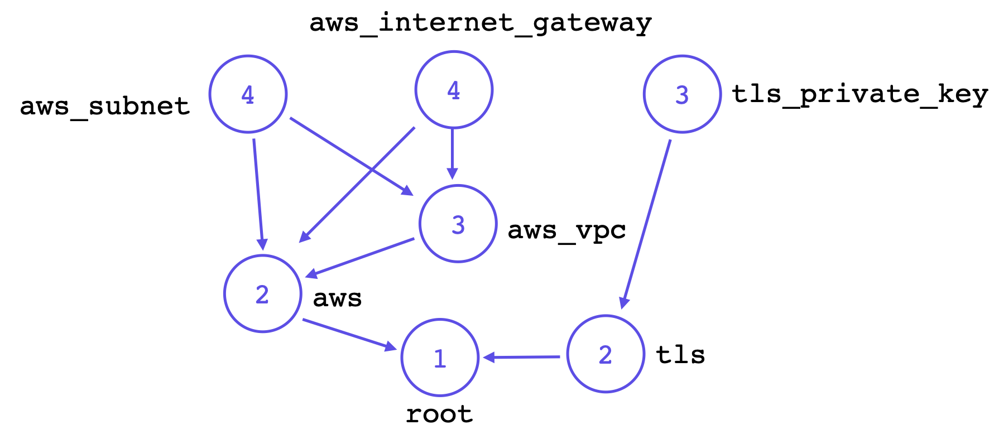
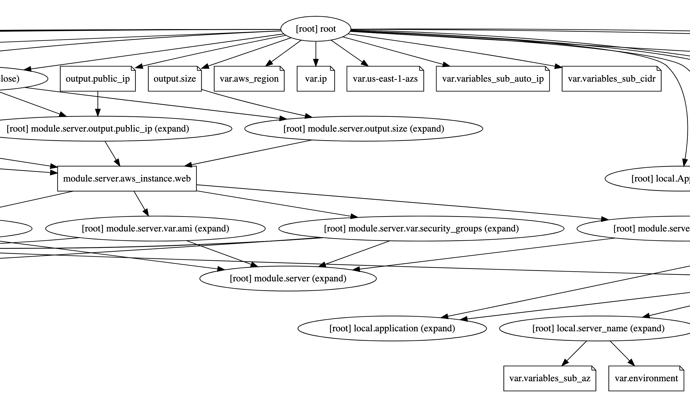
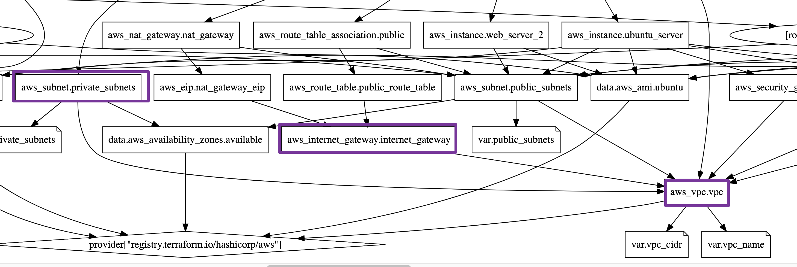

# Lab: Terraform Graph

Terraform's interpolation syntax is very human-friendly, but under the hood it builds a very powerful resource graph. When resources are created they expose a number of relevant properties and Terraform's resource graph allows it to determine dependency management and order of execution for resource buildouts. Terraform has the ability to support the parallel management of resources because of it's resource graph allowing it to optimize the speed of deployments.

The resource graph is an internal representation of all resources and their dependencies. A human-readable graph can be generated using the `terraform graph` command.

- Task 1: Terraform's Resource Graph and Dependencies
- Task 2: Generate a graph against Terraform configuration using `terraform graph`

## Task 1: Terraform's Resource Graph and Dependencies 

When resources are created they expose a number of relevant properties. Let's look at portion of our `main.tf` that builds out our AWS VPC, private subnets, internet gateways and private keys. In this case, our private subnets and internet gateway are referencing our VPC ID and are therefore dependent on the VPC. Our private key however has no dependencies on any resources.

```hcl
resource "aws_vpc" "vpc" {
  cidr_block = var.vpc_cidr

  tags = {
    Name        = var.vpc_name
    Environment = "demo_environment"
    Terraform   = "true"
  }

  enable_dns_hostnames = true
}

resource "aws_subnet" "private_subnets" {
  for_each          = var.private_subnets
  vpc_id            = aws_vpc.vpc.id
  cidr_block        = cidrsubnet(var.vpc_cidr, 8, each.value)
  availability_zone = tolist(data.aws_availability_zones.available.names)[each.value]

  tags = {
    Name      = each.key
    Terraform = "true"
  }
}

resource "aws_internet_gateway" "internet_gateway" {
  vpc_id = aws_vpc.vpc.id
  tags = {
    Name = "demo_igw"
  }
}

resource "tls_private_key" "generated" {
  algorithm = "RSA"
}
```

Because we have defined our infrastructure in code, we can build a data structure around it and then work with it. Some of these nodes depend on data from other nodes which need to be spun up first. Others might be disconnected or isolated. Our graph might look something like this, with the arrows showing the the dependencies and order of operations.



Terraform walks the graph several times starting at the root node and using the providers: to collect user input, to validate the config, to generate a plan, and to apply a plan. Terraform can determine which nodes need to be created sequentially and which can be created in parallel.  In this case our private key can be built in parallel with our VPC, while our subnets and internet gateways are dependent on the AWS VPC being built first.

## Task 2: Generate a graph against Terraform configuration using `terraform graph`

The `terraform graph` command is used to generate a visual representation of either a configuration or execution plan. The output is in the DOT format, which can be used by GraphViz to generate charts.  This graph is useful for visualizing infrastructure and dependencies.  Let's build out our infrastructure and use `terraform graph` to visualize the output.

```shell
terraform init
terraform apply
terraform graph
```

```text
digraph {
	compound = "true"
	newrank = "true"
	subgraph "root" {
# ...
  }
}
```

Paste that output into http://www.webgraphviz.com to get a visual representation of dependencies that Terraform creates for your configuration.



We can find our resources on the graph and follow the dependencies, which is what Terraform does everytime we exercise it's workflow.

