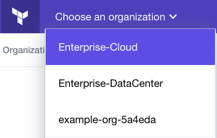
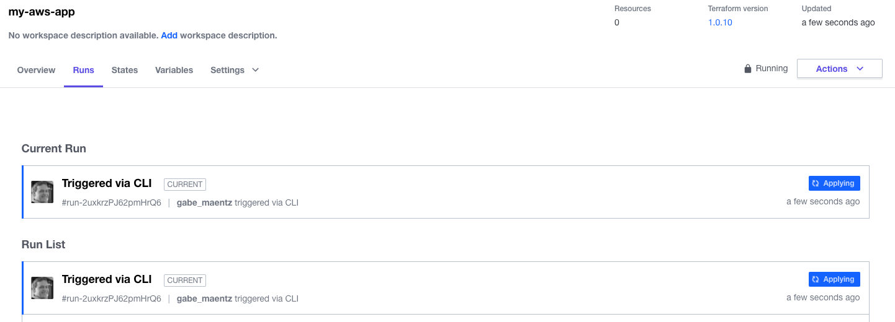
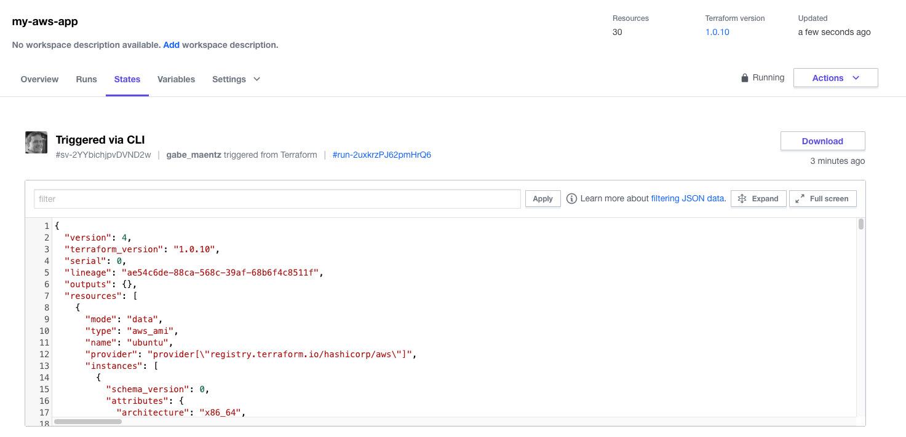

## Terraform Remote State - Enhanced Backend

Enhanced backends can both store state and perform operations. There are only two enhanced backends: `local` and `remote`. The `local` backend is the default backend used by Terraform which we worked with in previous labs. The `remote` backend stores Terraform state and may be used to run operations in Terraform Cloud. When using full remote operations, operations like terraform plan or terraform apply can be executed in Terraform Cloud's run environment, with log output streaming to the local terminal. Remote plans and applies use variable values from the associated Terraform Cloud workspace.

- Task 1: Log in to Terraform Cloud
- Task 2: Update Terraform configuration to use Remote Enchanced Backend
- Task 3: Re-initialize Terraform and Validate Remote Backend
- Task 4: Provide Secure Credentials for Remote Runs
- Task 5: View the state, log and lock files in Terraform Cloud
- Task 6: Remove existing resources with `terraform destroy`

Let's take a closer look at the `remote` enhanced backend.

## Task 1: Log in to Terraform Cloud

[Log in](https://app.terraform.io) to Terraform Cloud and determine your organization name.

> Note: You created a Terraform Cloud Organization in an earlier lab

Open the organization switcher menu in the top navigation bar and take note of your organization name.



## Task 2: Update Terraform configuration to use Remote Enchanced Backend

A configuration can only provide one backend block, so let's update our configuration to utilize the `remote` backend.

`terraform.tf`

```hcl
terraform {
 backend "remote" {
    hostname = "app.terraform.io"
    organization = "YOUR-ORGANIZATION"

    workspaces {
      name = "my-aws-app"
    }
  }
}
```

Update the `organization` name with what you noted in the previous step.

Example:

```hcl
terraform {
 backend "remote" {
    hostname = "app.terraform.io"
    organization = "Enterprise-Cloud"

    workspaces {
      name = "my-aws-app"
    }
  }
}
```

> Note: A Terraform configuration can only specify a single backend. If a backend is already configured be sure to replace it. Copy just the backend block above and not the full terraform block You can validate the syntax is correct by issuing a `terraform validate`

Be sure to issue a `terraform destroy` and delete any instances of the `terraform.tfstate` or `terraform.tfstate.backup` items locally as your state will be managed remotely.

## Task 3: Re-initialize Terraform and Validate Remote Backend

```shell
terraform init -reconfigure
```

```shell
Initializing the backend...

Successfully configured the backend "remote"! Terraform will automatically
use this backend unless the backend configuration changes.
```

```shell
terraform apply

Running apply in the remote backend. Output will stream here. Pressing Ctrl-C
will cancel the remote apply if it's still pending. If the apply started it
will stop streaming the logs, but will not stop the apply running remotely.

Preparing the remote apply...

To view this run in a browser, visit:
https://app.terraform.io/app/Enterprise-Cloud/my-aws-app/runs/run-sThbeRjvZUUpH4e9
```

Notice that the Terraform apply with the `remote` backend looks different then with the standard backends. The enhanced Terraform `remote` backend stores the state information within Terraform Cloud as well as performs all operations from Terraform Cloud. Therefore this backend supports the ability to centerally store state and centerally managed the Terraform workflow.

This can be validated by the messages returned when executing Terraform CLI commands using the `remote` backend.

## Task 4: Provide Secure Credentials for Remote Runs

Now that the terraform workflow is being run using the `remote` backend inside Terraform Cloud, we have to configure Terraform Cloud to use our AWS Credentials for building out our infrastructure. In fact during our last step you most likely encountered an error similar to the following:

```shell
 Error: error configuring Terraform AWS Provider: no valid credential sources for Terraform AWS Provider found.

 Please see https://registry.terraform.io/providers/hashicorp/aws
 for more information about providing credentials.
```

We can provide Terraform Cloud with our AWS Credentials as environment variables inside the `Variables` section of our workspace.


Select `Add variable`, Select `Environment variable`. Create both a `AWS_ACCESS_KEY_ID` and `AWS_SECRET_ACCESS_KEY` environment variable with the AWS credentials. Now whenever the Terraform workflow is executed using our configured `remote` backend, Terraform Cloud knows which credentials to use to access our AWS cloud account.

You can mark one or both of these variables as `Sensitive` so that others cannot view their values.


Once set you can build out the infrastructure

```shell
terraform apply

Running apply in the remote backend. Output will stream here. Pressing Ctrl-C
will cancel the remote apply if it's still pending. If the apply started it
will stop streaming the logs, but will not stop the apply running remotely.

Preparing the remote apply...

To view this run in a browser, visit:
https://app.terraform.io/app/Enterprise-Cloud/my-aws-app/runs/run-2uxkrzPJ62pmHrQ6

Waiting for the plan to start...

Terraform v1.0.10
on linux_amd64
Configuring remote state backend...
Initializing Terraform configuration...
....

Plan: 27 to add, 0 to change, 0 to destroy.


Do you want to perform these actions in workspace "my-aws-app"?
  Terraform will perform the actions described above.
  Only 'yes' will be accepted to approve.

  Enter a value: yes
```

You can view the apply also within the Terraform Cloud UI.




## Task 5: View the state, log and lock files in Terraform Cloud

Using the `remote` backend allows you to connect to Terraform Cloud. Within the Terraform Cloud UI you'll be able to:

- View Terraform run history
- View state history
- View all your organization's workspaces
- Lock a workspace, making it easy to avoid conflicting changes and state corruption
- Execute the Terraform workflow via CLI or UI

Let's view the state file in Terraform Cloud.

- If you aren't already, log in to Terraform Cloud in your browser
- Navigate to your Workstation
- In your Workstation UI page, click on the `States` tab
- You should see something along the lines of this in the `States` tab. This indicates that your state file is now being stored and versioned within Terraform Cloud using the `remote` backend.
- 

## Task 6: Remove existing resources with `terraform destroy`

We will now issue a cleanup of our infrastructure using a `terraform destroy`

```shell
terraform destroy

Plan: 0 to add, 0 to change, 27 to destroy.

Do you really want to destroy all resources?
  Terraform will destroy all your managed infrastructure, as shown above.
  There is no undo. Only 'yes' will be accepted to confirm.

  Enter a value: yes
```
