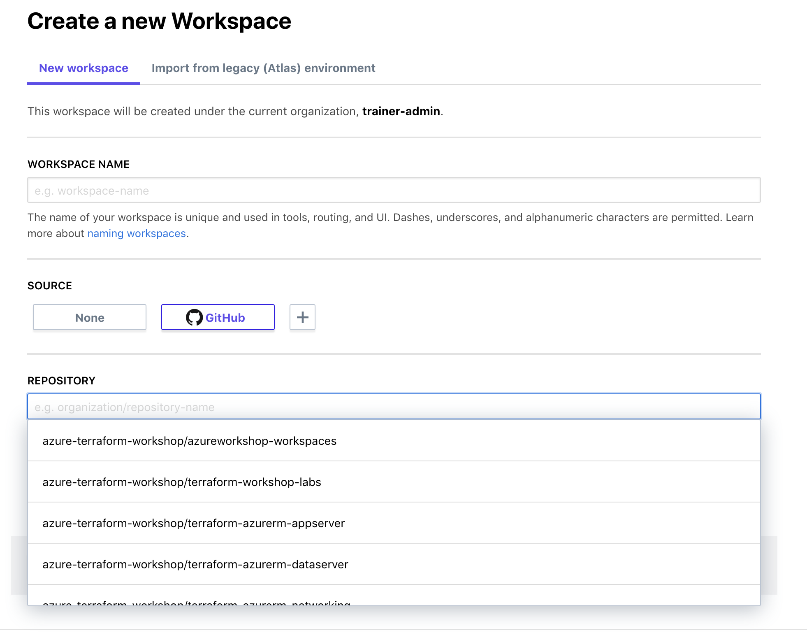

# Lab: Terraform Cloud - Version Control

In order for different teams and individuals to be able to work on the same Terraform code, you need to use a Version Control System (VCS). Terraform Cloud can integrate with the most popular VCS systems including GitHub, GitLab, Bitbucket and Azure DevOps.

This lab demonstrates how to connect Terraform Cloud to your personal Github account.

- Task 1: Sign-up/Sign-in to GitHub
- Task 2: Create Terraform Cloud VCS Connection
- Task 3: Verify Connection

## Task 1: Configuring GitHub Access

You will need a free GitHub.com account for this lab. We recommend using a personal account. You can sign up or login in to an existing account at https://github.com/

## Task 2: Create Terraform Cloud VCS Connection

1. Login to github in one browser tab.
2. Login to Terraform Cloud in another browser tab.
3. Within Terraform Cloud navigate to the settings page

4. Click "VCS Providers" link:

For full instructions follow the **Configuring GitHub Access** section of the Terraform Cloud documentation to connect your GitHub account to your Terraform Organization.

[Configuring GitHub Access](https://www.terraform.io/docs/cloud/vcs/github.html) - https://www.terraform.io/docs/cloud/vcs/github.html

> Note: The process involves several back and forth changes and is documented well in the link.

## Task 3: Verify Connection

1. Navigate to <https://app.terraform.io> and click "+ New Workspace"
2. Click the VCS Connection in the "Source" section.
3. Verify you can see repositories:

If you can see repositories then you are all set.

In future labs we will utilize the VCS connection to connect our Terraform code to Terraform Cloud workspaces as well as the Private Module Registry.
