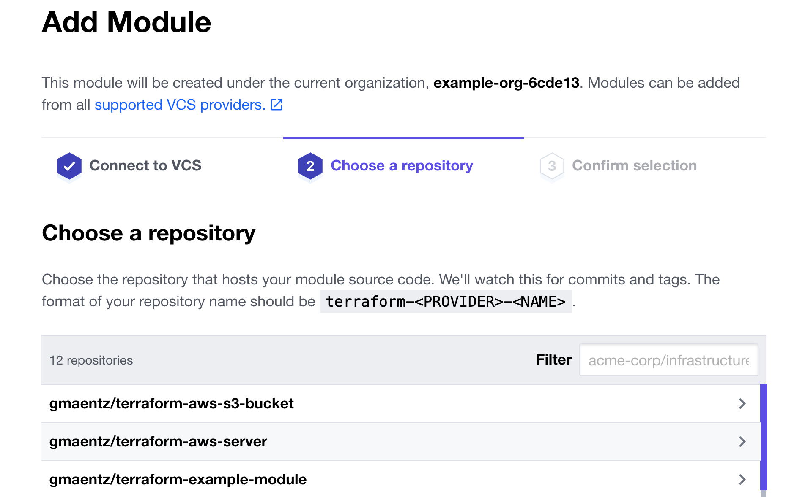
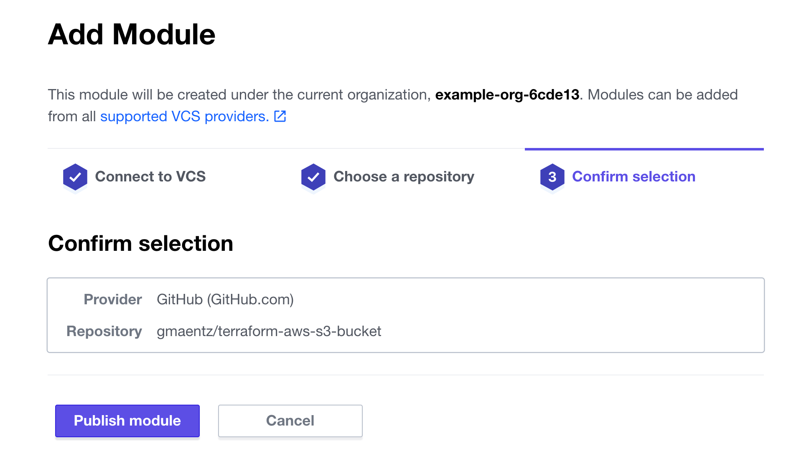

# Lab: Terraform Cloud - Private Module Registry

Terraform Cloud's Private Module Registry allows you to store and version Terraform modules which are re-usable snippets of Terraform code. It is very similar to the Terraform Public Module registry including support for module versioning along with a searchable and filterable list of available modules for quickly deploying common infrastructure configurations.

The Terraform Private Module Registry is an index of private modules that you don't want to share with publicly. This lab demonstrates how to register a module with your Private Module Registry then reference it in a workspace.

- Task 1: Move terraform module code to a private GitHub repository
- Task 2: Publish module to Private Module Registry
- Task 3: Review module block reference to Private Module Registry

## Task 1: Move terraform module code to a private GitHub repository

Instead of writing a terraform module from scratch we will copy and existing S3 module from the public Terraform registry. Visit this URL to view the AWS S3 module:

https://github.com/terraform-aws-modules/terraform-aws-s3-bucket

### Step 1.1 Fork the Module Repository to your GitHub account

You are going to fork the following repository into your own GitHub account:

- https://github.com/terraform-aws-modules/terraform-aws-s3-bucket

This repository represents a module that can be developed and versioned independently. Note the **Source:** link that points at the github repository for this module. Click on the Source URL and create your own fork of this repository with the **Fork** button.

## Task 2: Publish module to Private Module Registry

We need to add this repository into the Private Module Registry. Navigate back to Terraform Cloud and click the "Modules" menu at the top of the page. From there click the "+ Add Module" button.



Select the S3 repository you forked earlier.



> Note: You will see your github user name since you forked this repo.

Click "Publish Module".

This will query the repository for necessary files and tags used for versioning.


## Task 3: Review module block reference to Private Module Registry

Now that the module has been published to the Private Module registry, we can utilize it within any module block in our terraform configuration. Note the `source` and `version` of the newly published private module.

```hcl
module "s3-bucket" {
  source  = "app.terraform.io/example-org-6cde13/s3-bucket/aws"
  version = "1.17.0"
  # insert required variables here
}
```

## Resources

- [Private Registries](https://www.terraform.io/docs/registry/private.html)
- [Publishing Modules](https://www.terraform.io/docs/registry/modules/publish.html)
