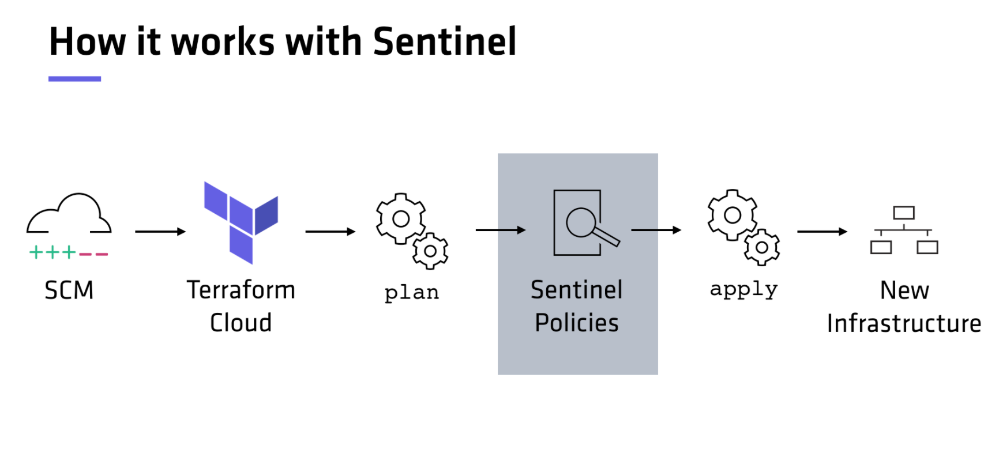
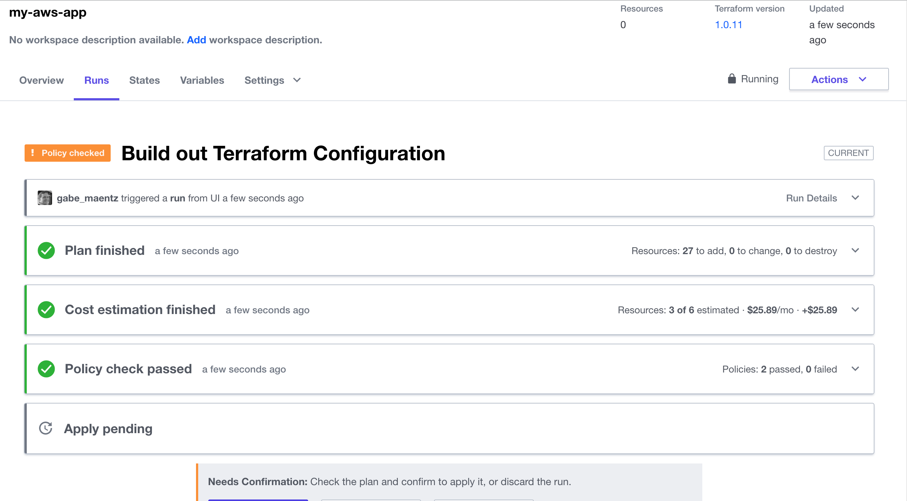
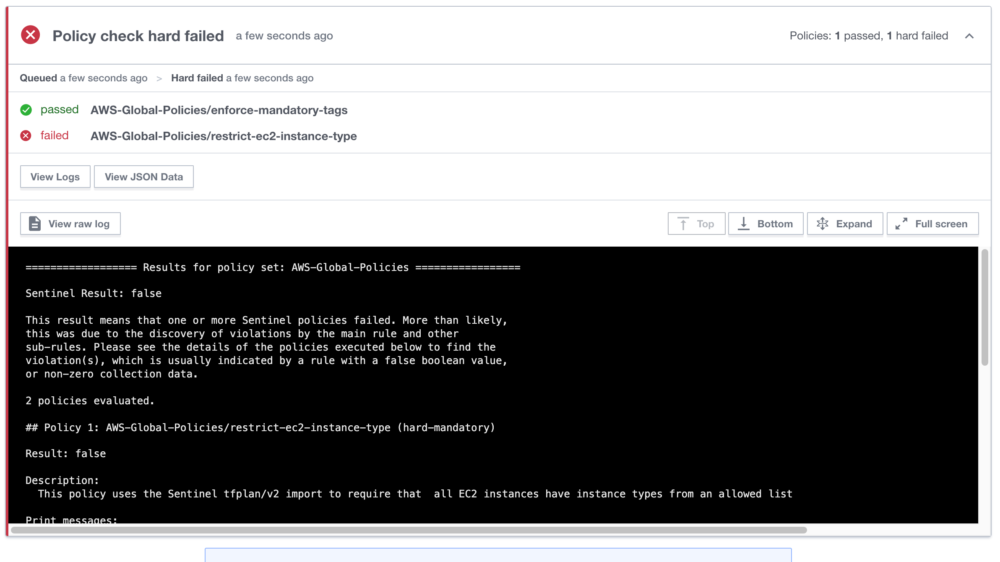

# Lab: Terraform Cloud - Sentinel Policy

Sentinel is the Policy-as-Code product from HashiCorp that automatically enforces logic-based policy decisions across all HashiCorp Enterprise products. It allows users to implement policy-as-code in a similar way to how Terraform implements infrastructure-as-code. If enabled, Sentinel is run between the terraform plan and apply stages of the workflow.



In this lab we are going to use sentinel policy within Terraform Cloud to determine if it should deploy the infrastructure from our plan based on policy enforcement.

- Task 1: Setup Workspace in Terraform Cloud
- Task 2: Create Sentinel Policy
- Task 3: Apply policy sets to the organization and application workspace
- Task 4: Test and Enforce Sentinel Policy

## Task 1: Setup Workspace in Terraform Cloud

You should already have a Terraform Cloud account with Team and Governance capabilities, if it has been less 30 days since you activated the trial on your Terraform Cloud account you are good to go. If you do not have a Terraform Cloud account already, please create an account.

## Task 2: Create Sentinel Policy

Let's write a Sentinel policy to set guardrails around one of type of resources created by our Terraform configuration. We want to enforce two organization requirements for EC2:

- EC2 instances must have a Name tag.
- EC2 instances must be of type t2.micro, t2.small, or t2.medium.

First we need a place to store our policies. Sentinel is a policy as code framework, so just like Terraform code we should store Sentinel code in a Version Control System like GitHub.

Create a fork of the following GitHub repo, which contains several Sentinel policies that you can use in your own organization. Use the **Fork** button in the upper right corner of the screen to create your own copy into your GitHub account.

https://github.com/btkrausen/hashicorp

### 2.1 Sentinel Policies

The Sentinel policies we will be using from this forked repo are:

- [enforce-mandatory-tags](https://github.com/btkrausen/hashicorp/blob/master/terraform/Lab%20Prerequisites/Terraform%20Cloud%20Sentinel/global/enforce-mandatory-tags.sentinel) policy.
- [restrict-ec2-instance-type](https://github.com/btkrausen/hashicorp/blob/master/terraform/Lab%20Prerequisites/Terraform%20Cloud%20Sentinel/global/restrict-ec2-instance-type.sentinel) policy.

The `enforce-mandatory-tags` policy requires all EC2 instances to have a `Name` tag and the `restrict-ec2-instance-type` policy only allows EC2 instances of type: `t2.micro`, `t2.small`, or `t2.medium`.

These policies use some functions from a Sentinel module in a different repository called [terraform-guides](https://github.com/hashicorp/terraform-guides). You'll find many useful Sentinel policies and functions in its [governance/third-generation](https://github.com/hashicorp/terraform-guides/tree/master/governance/third-generation) directory.

### 2.1 Sentinel Policy Set

You can group individual Sentinel policies together and specify their enforcement level using a Sentinel policy set. We will be using a Sentinel policy set from the forked repo which is contained in a `sentinel.hcl` file. A policy set is a collection of sentinel policies are are defined within the `sentinel.hcl` file. This level of enforcement for your Sentinel policies is also defined here. If you have multiple policies in your policy repository, you list them within a policy set and Terraform Cloud applies the policies in the order they appear in this file. We are also making use of sentinel modules to include some functions used by our Sentinel policies.

`sentinel.hcl`

```hcl
module "tfplan-functions" {
  source = "https://raw.githubusercontent.com/hashicorp/terraform-guides/master/governance/third-generation/common-functions/tfplan-functions/tfplan-functions.sentinel"
}

module "tfconfig-functions" {
    source = "https://raw.githubusercontent.com/hashicorp/terraform-guides/master/governance/third-generation/common-functions/tfconfig-functions/tfconfig-functions.sentinel"
}

policy "enforce-mandatory-tags" {
    enforcement_level = "advisory"
}

policy "restrict-ec2-instance-type" {
    enforcement_level = "hard-mandatory"
}
```

Policy enforcment levels are also defined inside the policy set. Sentinel has three enforcement levels:

- **Advisory**: The policy is allowed to fail. However, a warning should be shown to the user or logged.

- **Soft Mandatory**: The policy must pass unless an override is specified. The semantics of "override" are specific to each Sentinel-enabled application. The purpose of this level is to provide a level of privilege separation for a behavior. Additionally, the override provides non-repudiation since at least the primary actor was explicitly overriding a failed policy.

- **Hard Mandatory**: The policy must pass no matter what. The only way to override a hard mandatory policy is to explicitly remove the policy. Hard mandatory is the default enforcement level. It should be used in situations where an override is not possible.

## Task 3: Apply policy sets to the Terraform Cloud organization

Now that the policies and policy sets are defined, let's connect them to our Terraform Cloud organization.

1. Go into the **Organization Settings** for your training organization and click on **Policy Sets**.


2. Use the **Connect a new policy set** button to connect your new GitHub repo to your organization. Remember, the repository is named **hashicorp**.
3. Under **Name** enter "AWS-Global-Policies"
4. Under **Description** you can enter "Sentinel Policies for our AWS resources".
5. In the **More Options** menu set the **Policies Path** to `terraform/Lab Prerequisites/Terraform Cloud Sentinel/global`. This tells Terraform Cloud to use the AWS specific policies that are stored in the repo.
6. Leave everything else at its default setting and click on the **Connect policy set** button at the bottom of the page.

## Task 4: Test and Enforce Sentinel Policy

We can test our Sentinel policies by performing a Terraform run on our Terraform Cloud workspaces.

### 4.1 Manually Run a Plan

Navigate to your "my-aws-app" and queue a plan.

### 4.2 Review the Plan

You will now see a new phase within the Terraform run called Policy Check. We see that the plan was successful with both policy checks passing.



You can navigate into the Policy check portion of the run to see more details about the policies included in the policy set and their status


Confirm & Apply the plan.

### 4.3 Update the Terraform Code to update the instance size

Now let's update our code to specify an instance size that is not allowed via policy. Navigate to the `web_server` resource block and update the `instance_type` to `m5.large`

```
resource "aws_instance" "web_server" {
  ami                         = data.aws_ami.ubuntu.id
  instance_type               = "m5.large"
  subnet_id                   = aws_subnet.public_subnets["public_subnet_1"].id
  security_groups             = [aws_security_group.vpc-ping.id, aws_security_group.ingress-ssh.id, aws_security_group.vpc-web.id]
  associate_public_ip_address = true
  key_name                    = aws_key_pair.generated.key_name
  connection {
    user        = "ubuntu"
    private_key = tls_private_key.generated.private_key_pem
    host        = self.public_ip
  }

```

### 4.4 Manually Run a Plan

Queue a new terraform run that includes this change by initiating a `terraform init` and `terraform plan`

```
terraform init
terraform plan
```

### 4.5 Review the Plan

Will see the plan was unsuccessful because of a policy failure in moving to an `instance_type` that is not allowed.

```
Result: false

Description:
  This policy uses the Sentinel tfplan/v2 import to require that  all EC2 instances have instance types from an allowed list

Print messages:

aws_instance.web_server has instance_type with value m5.large that is not in the allowed list: [t2.micro, t2.small, t2.medium]
```

The policy is set to `hard-mandatory` enforcement that prevents the plan from moving forward. The enforcement level can be adjusted within the policy set `sentinel.hcl` if desired.



### Step 4.6 Update the configuration to mantain compliance

Now let's update our code to specify an instance size that is allowed via policy. Navigate to the `web_server` resource block and update the `instance_type` to `t2.medium`

```
resource "aws_instance" "web_server" {
  ami                         = data.aws_ami.ubuntu.id
  instance_type               = "t2.medium"
  subnet_id                   = aws_subnet.public_subnets["public_subnet_1"].id
  security_groups             = [aws_security_group.vpc-ping.id, aws_security_group.ingress-ssh.id, aws_security_group.vpc-web.id]
  associate_public_ip_address = true
  key_name                    = aws_key_pair.generated.key_name
  connection {
    user        = "ubuntu"
    private_key = tls_private_key.generated.private_key_pem
    host        = self.public_ip
  }
```

Queue a new terraform run:

```
terraform plan
```

This time the planned change is highlighted, along with the cost impact and is compliant with our organizational policy.


## Resources

- [Sentinel Language Spec](https://docs.hashicorp.com/sentinel/language/spec)
- [Experiment in the Sentinel Playground](https://play.sentinelproject.io/)
